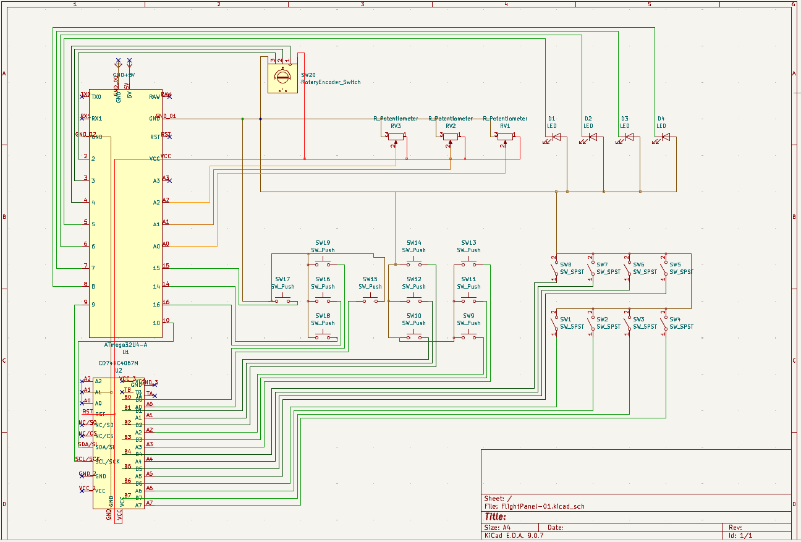
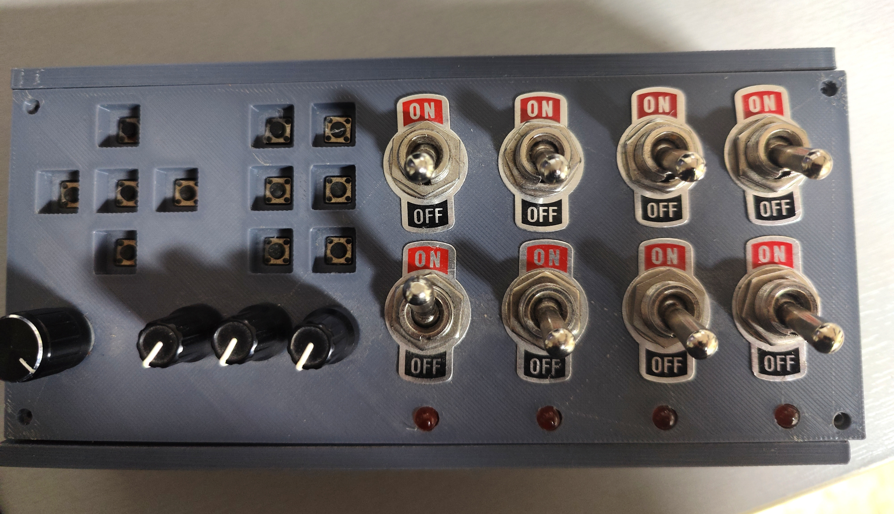
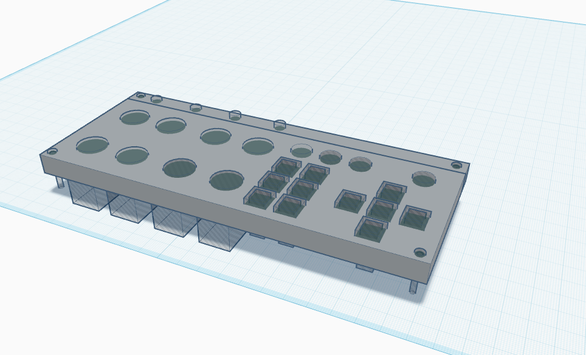

# ATmega32U4 Button Panel V1.0

> [!IMPORTANT]
> **Private Learning Project:** This is a personal experimental project focused on learning PCB design, hardware architecture, and iterative improvements.
> 
> **Feedback is welcome!** If you have suggestions for improvements or find issues, please feel free to:
> - Reach out via **private message** or email.
> - Start a topic in the **Discussions** tab.
> - Open a **Pull Request** with your proposed changes.

## Table of Contents
- [Overview](#overview)
- [Hardware Specifications](#hardware-specifications)
- [Project Status](#project-status)
- [Technical Reference](#technical-reference)
- [Security](#security)

---

## Overview
FlightPanel-01 is a custom input controller based on the **ATmega32U4** (Arduino Pro Micro compatible). This project serves as a bridge for migrating an older design into a new, consolidated prototype. It features a high-density input matrix using a 16-channel multiplexer to support a variety of flight simulation controls.

## Hardware Specifications
- **MCU:** ATmega32U4 (TQFP-44)
- **Multiplexer:** CD74HC4067M (16-Channel Analog Mux/Demux)
- **Inputs:**
  - 8x Toggle Switches (via Mux)
  - 11x Tactile Push Buttons (8 via Mux, 3 direct)
  - 1x Rotary Encoder with Push Button (direct)
  - 3x Potentiometers (Analog)
- **Outputs:**
  - 4x Cathode-driven LEDs (PWM capable)

## Project Status
This repository is currently in the **prototype and migration phase**. The schematic and initial PCB layouts are being refined to ensure compatibility between legacy code and the new hardware architecture.

## Technical Reference
For detailed pin mappings, multiplexer channel assignments, and component connections, please refer to the [PINOUT_REFERENCE.md](PINOUT_REFERENCE.md).

---

## Security
If you discover any security-related issues, please contact the maintainer directly:
📧 **arn-c0de@protonmail.com**
